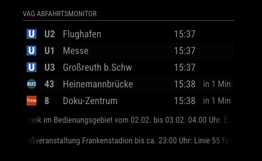

# MMM-VAG [](https://github.com/wiesty/MMM-VAG/raw/master/LICENSE) 

MagicMirror² module to display public transport from Nürnberg (VAG) in Germany.



## Dependencies

* instance of [MagicMirror²](https://github.com/MagicMirrorOrg/MagicMirror)

## Installation

1. Clone this repository in your MagicMirror installation into the modules directory:

    ```bash
    cd ~/MagicMirror/modules
    git clone https://github.com/wiesty/MMM-VAG
    ```

2. Find your stop ID using the VAG API:
   - Visit: `https://start.vag.de/dm/api/haltestellen.json/vgn?name=YOUR_STOP_NAME`
   - Find your stop in the results and note the `VGNKennung` (numeric ID)
   - Example: For "Hauptbahnhof" search: `https://start.vag.de/dm/api/haltestellen.json/vgn?name=Hauptbahnhof`

3. Add configuration to your `config.js`.

## Config

```js
    {
        module: "MMM-VAG",
        position: "bottom_left",
        config: {
            maxEntries: 5,                  // Maximum number of departures to display
            stopId: 510,                    // Stop ID (VGNKennung) for your station - Example: 510 for Hauptbahnhof
            filter: {},                     // Filter by line and/or direction (optional)
            displayNotifications: true,     // Show notifications for each departure if available
            displayBundled: true,           // prevent notifications beeing displayed multiple times
            scrollSpeed: 40,                // Speed for scrolling notifications
            minTimeUntilDeparture: 0        // Minimum time in minutes until departure to display
        }
    },

```

### Configuration Options

* **maxEntries**: The maximum number of departures to display on the screen.
* **stopId**: The unique numeric ID (VGNKennung) for the stop. Find this ID using the VAG API stop search.
* **filter**: Object for filtering departures by line number and/or direction (details below).
* **displayNotifications**: Enables or disables notifications for each departure, such as delays or route changes.
* **scrollSpeed**: The speed at which notification text scrolls across the screen.
* **minTimeUntilDeparture**: Specifies the minimum time (in minutes) for departures to be displayed. For example, if set to `3`, only departures leaving in 3 minutes or more will appear.

### Filter by Line and Direction

You can filter departures by both line number and direction. To do so, add the line numbers as keys and the desired directions as values in the `filter` object in your module configuration.

Example:

```js
    filter: {
      "5": "Tiergarten",
      "45": "Plärrer"
    },
```

With the above configuration, the module will only display departures for the line 5 going towards Tiergarten and the bus line 45 towards Plärrer.

### Filter by Line Only

If you want to display departures for certain lines regardless of their direction, simply provide the line number with an empty string as the value. For example:

```js
    filter: {
      "5": "",
      "45": ""
    },
```

This configuration results in the module showing all departures for the tram line 5 and bus line 45, irrespective of their direction.

### Multiple Directions Example

You can specify multiple destinations for a single line by using an array. For example:

```js
    filter: {
      "5": ["Tiergarten", "Schweinau", "Doku-Zentrum"]
    },
```

This configuration will display all line 5 (tram) departures heading towards Tiergarten, Schweinau, or Doku-Zentrum. If any of these directions match the current destination of the line, the departure will be shown.

### Display All Departures

To show all departures without any filtering, you can either leave the `filter` object empty, delete it from the config or include the key `all` with an empty string as its value. Both of these configurations will display every departure:

```js
    filter: {},
```

Or:

```js
    filter: {
      "all": ""
    },
```

This flexible filtering system ensures that you can always access the departures that are most relevant to you without any unnecessary clutter.

### Overall CSS Layout (`.MMM-VAG` and `.vag-table`) - useful for custom css

* **`.MMM-VAG .module-content`**: Limits the module's maximum width to `25vw`, allowing it to adjust responsively up to that width. The module is centered horizontally and has overflow hidden to prevent text spilling out.
* **`.vag-table`**: Sets the table width to `100%`, collapses borders for a cleaner look, and uses a fixed table layout to maintain column widths. This class also sets the font size and line height.

### Cell-Specific Classes

* **`.icon-cell` & `.line-cell`**: These two cells are the narrowest, each set to a width of `1vw` to minimize spacing. Both cells have right padding (`5px`) and text aligned to the start (left) for a compact display of line numbers and icons.

* **`.direction-cell`**: Displays the direction text of each departure with specific settings:

  * **Width**: `8vw`, allowing for adequate space without pushing other elements off.
  * **Overflow**: `hidden`, `white-space: nowrap`, and `text-overflow: ellipsis` ensure that long text will not wrap and instead shows an ellipsis (`...`) when text is truncated.
  * **Customizations**: If direction text is cut off or requires more space, consider increasing `width` or adjusting `text-overflow`.
* **`.time-cell`**: Displays the departure time, with a width of `6vw`, making it slightly narrower than the direction cell but wide enough for typical HH

    formatting. It also has `white-space: nowrap` and `overflow: hidden` to ensure text remains on one line.

* **`.until-cell`**: Shows the “time until departure” information with a narrower width of `3vw`. This cell is also set to nowrap and hidden overflow to keep the text compact. If more padding is needed, adjust the `padding` or `width` as desired.

* **`.notification-cell`**: Used for displaying notifications. It spans all columns (`colSpan=5`) and has overflow hidden to keep long notification text within bounds.

## Changelog

### v1.0.0 - VAG Nürnberg Release

* **Complete rewrite for VAG Nürnberg**: Adapted from MVV Munich to VAG Nürnberg public transport system.
* **VAG API Integration**: Uses VAG's official API endpoints for real-time departure information.
* **Stop ID Format**: Changed from string-based MVV IDs to numeric VGN IDs (e.g., `510` instead of `"de:09162:6"`).
* **Product Detection**: Improved line icon detection for VAG's transport modes (Bus, Tram, U-Bahn, S-Bahn).
